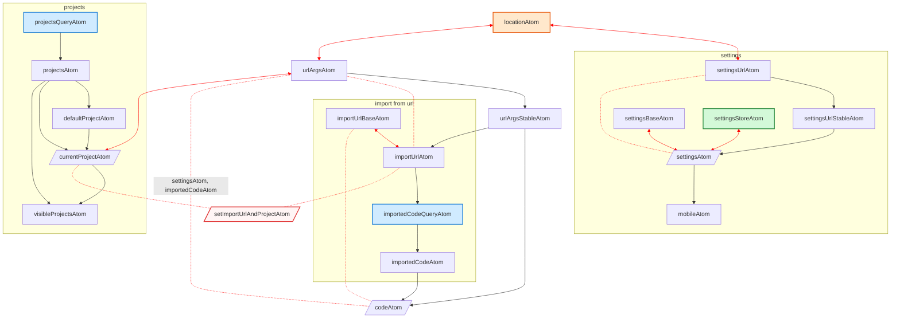

- [Back to README](../README.md)
- [User Manual](./Usage.md)
- [Installation](./Installation.md)
- [Adding Projects](./Projects.md)
- Development
- [Server Maintenance](./Maintenance.md)
- [Troubleshoot](./Troubleshoot.md)

## Development Instructions

Install [npm](https://www.npmjs.com/) and clone this repository. Inside the repository, run:

1. `npm install`, to install dependencies
2. `npm run build:server`, to build contained lean projects under `Projects/` (or run `lake build` manually inside any lean project)
3. `npm start`, to start the server.

The project can be accessed via http://localhost:3000. (Internally, websocket requests to `ws://localhost:3000/`websockets will be forwarded to a Lean server running on port `8080`.)

### Testing

Automated integration tests using `cypress`.

- Headless tests:
  ```
  npm test
  ```
- Cypress also has an interactive UI. Run both of these commands simultaneously:
  ```
  npm start
  npx cypress open
  ```

The tests produce screenshots on failure. In the Github-CI, failing tests will produce screenshots and videos which will be attached as artifacts for inspection.

### Application Design

#### Atom structure

The project uses various jotai atoms to describe the internal state. Below is an overview. Downwards-arrows mean the lower atom depends on the upper one, upwards arrows (red) mean the setter of the lower atom writes the upper one. Dotted lines are "setter-only".

The colors symbolise outside influence: queries (blue), the page url (orange) or browser storage (green). Red atoms are "setter-only".

Atoms which are changed by "user input" displayed as rhomboid.


